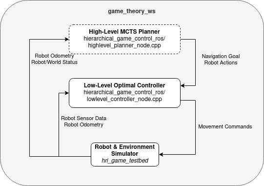

# game_theory_ws
A ROS workspace to implement complex, intelligent human-robot interaction behaviors in dynamic environments using game-theoretical approaches. This was initially created as a final project for ASE 389: Game Theoretical Modeling of Multiagent Systems, Fall 2022 at the University of Texas - Austin taught by [Dr. David Fridovich-Keil](https://clearoboticslab.github.io/).

This repository is intended to be a central hub for developing game-theoretical planning and control methods for my Ph.D. research. Specifically, I am interested in robots that operate in dynamic, human-centered environments. Game theoretical models are well-suited for these situations, since they inherently involve multiple agents (players) in collaborative and/or adversarial roles, and no two operating environments (game states) are the same.

As of December 2022, this project is organized as follows:
- This repository ([game_theory_ws](https://github.com/roboav8r/game_theory_ws)), which contains the project writeup, initial results and future plans, and installation instructions
- A Robot Operating System (ROS)-Gazebo simulator testbed ([hri_game_testbed](https://github.com/roboav8r/hri_game_testbed)), which serves as a controlled, repeatable development environment prior to deployment on robot hardware, and
- A ROS-enabled game-theoretical, hierarchical planner-controller module ([hierarchical_game_control_ros](https://github.com/roboav8r/hierarchical_game_control_ros)), which receives state variable observations from `hri_game_testbed`, computes an optimal course of action/control inputs, and sends them to the simulated robot.

These elements are discussed in further detail below. For collaboration or any questions/comments/concerns about this project, feel free to [contact me](mailto@john.a.duncan@utexas.edu) or [raise an issue](https://github.com/roboav8r/game_theory_ws/issues/new/choose)!

# Motivation and Hierarchical Control Approach
Robots and autonomous systems are expanding into a range of complex, dynamic, and populated operating environments. Novel service applications see robots operating in airports, hospitals, museums, city centers, and battlefields. However, robot action planning in such environments is inherently challenging: the correct course of action is situationally-dependent, or [*situated*](http://erichorvitz.com/naacl_directions_dialog.pdf), and depends on the robot's goals and capabilities in addition to the status of the environment and agents within it (i.e. humans and vehicles).

The motivating example for this project is *human-robot interaction* in such environments. New service applications will require robots to accomplish service tasks while acting alongside humans in various roles (teammates, pedestrians, adversaries). Potential service tasks include social navigation, cargo/parcel delivery, information sharing, and leading/following behaviors. Since these tasks involve a dynamic combination of multiple discrete and continuous elements, robots in dynamic environments require a planning and control architecture that can act optimally across a range of potential operating states and conditions.

To this end, this project employs a two-layer hierarchical planning & control architecture. This architecture could enable robots & autonomous systems to affect intelligent behaviors amidst uncertain or changing states. The architecture is directly motivated by the implementation in Thakkar *et al* "[Hierarchical Control for Cooperative Teams in Competitive Autonomous Racing](https://arxiv.org/abs/2204.13070)" in which the authors employ a high-level, low-frequency discrete planner with a low-level, high-frequency continuous controller (see Figure below).


Specifically, this project implements a **Monte-Carlo Tree Search (MCTS)** to plan high-level robot behaviors, and a **Nonlinear Constrained Optimal Controller** to send motion control commands. These elements are discussed in detail in the following section.

# System Overview
The main system elements interact as shown in the diagram below.



This repository retains the testbed and hierarchical controller as submodules, while the hierarchical controller receives data from & sends commands to the testbed. Please see the following subsections for additional information on the testbed & hierarchical controller.

## hri_game_testbed
The testbed is implemented in ROS Gazebo and allows controlled, rapid development of the hierarchical planning & control architecture. It is intended to be a stand-in for real robot hardware until the hierarchical controller can safely be deployed on robot hardware. As such, it provides simulated sensor data and can accept robot motion commands via standard ROS message types.

At present, the only level is a simulated cargo pickup/dropoff task for a [PR2 robot](http://wiki.ros.org/Robots/PR2), taking place in an indoor hospital environment with known map. There are two variants, `worlds/hospital.world` and `worlds/hospital_empty.world`, which respectively do and do not contain humans.


The map can be launched by following the instructions in the [Usage](#usage) section and publishes relevant information about the PR2 on the following ROS topics:
```
/base_pose_ground_truth       # Robot odometry as a nav_msgs/Odometry message
/base_scan                    # Laser ranging data as a sensor_msgs/LaserScan message
```

The PR2 can be commanded to move by publishing a `geometry_msgs/Twist` message to the following topic:
```
/base_controller/command
```

## hierarchical_game_control_ros
The game theoretical, hierarchal planner-controller is implemented in the [hierarchal_game_control_ros](https://github.com/roboav8r/hierarchical_game_control_ros) package. The high-level planner and low-level controller work in tandem to interpret sensor measurements, select an optimal plan of action, and send commands to the (simulated) robot. At present the system is designed for a single task: cargo pickup and delivery. However, the software could be extended to work in additional applications (see [Future Work](#future-work)).

### lowlevel_controller_node

#### Inputs
The low level controller node has three inputs:
- The robot's current state $x$, comprised of its 2D position $[x_{robot}, y_{robot}]$, heading $\theta$, and velocity $v$. This information is received through a `nav_msgs/Odometry` ROS message on the `/base_pose_ground_truth` topic and necessary conversions are made by [robotOdomCallback in lowlevel_controller_node.h](https://github.com/roboav8r/hierarchical_game_control_ros/blob/99c2929aae19267068c40bffcc398295d80bbd75/include/lowlevel_controller_node.h#L54-L65).
- A 2D navigation goal $[x_{goal}, y_{goal}]$, in the map frame. $[x_{goal}, y_{goal}]$ is received as a `move_base_msgs/MoveBaseGoal` message on the `/nav_goal` topic.
- LiDAR range data from the laser scanner, received as a `sensor_msgs/LaserScan` ROS message on the `/base_scan` topic. The range measurements are converted from the robot's frame into the `map` frame and saved by the [scanCallback function in lowlevel_controller_node.h](https://github.com/roboav8r/hierarchical_game_control_ros/blob/99c2929aae19267068c40bffcc398295d80bbd75/include/lowlevel_controller_node.h#L67-L81).

The ROS subscribers are created in [lowlevel_controller_node.cpp](https://github.com/roboav8r/hierarchical_game_control_ros/blob/99c2929aae19267068c40bffcc398295d80bbd75/src/lowlevel_controller_node.cpp#L20-L29)

#### Outputs
Given the inputs above, the controller computes the optimal control output $u = [\omega \\ a]^T$, where $\omega = \dot{\theta}$ is the yaw rate (rotation about the robot's $+z$ axis), and $a=\dot{v}$ is the linear acceleration (translation about the robot's $+x$ axis). The optimal control outputs are sent to the robot base as a `geometry_msgs/Twist` ROS message on the `/base_controller/command` topic by a [publisher in `lowlevel_controller_node.cpp`](https://github.com/roboav8r/hierarchical_game_control_ros/blob/99c2929aae19267068c40bffcc398295d80bbd75/src/lowlevel_controller_node.cpp#L18).

#### Algorithm
The low level controller models the control problem as a nonlinear program comprised of a **cost function** to be minimized by adjusting **variables** subject to **constraints**. [Optimizer Interface (IFOPT)](https://github.com/ethz-adrl/ifopt), a C++/Eigen-based interface to solvers such as IPOPT and SNOPT, then solves the constrained optimization problem.

The low level controller minimizes the following cost functions:
```math
J_{goal} = w_{goal}[(x_{robot} - x_{goal} + v_tcos(\theta_t)\Delta t)^2 + (y_{robot} - y_{goal} + v_tsin(\theta_t)\Delta t)^2]
```
```math
J_{input} = w_{yaw}(\omega)^2 + w_{acc}(a)^2\\
```
```math
J_{obst} = -\sum^{N_{obst}}_{i=1}w_{axial}log[cos\theta_t(x_{obst,i} - x_{robot}) + sin\theta_t(y_{obst,i} - y_{robot})]^2\\

-\sum^{N_{obst}}_{i=1}w_{lat}log[-sin\theta_t(x_{obst,i} - x_{robot}) + cos\theta_t(y_{obst,i} - y_{robot})]^2\\
```
which penalize distance from the navigation goal, large control inputs, and proximity to obstacles, respectively. This cost structure is derived from Lasse Peters _et al_, ["Inferring Objectives in Continuous Dynamic Games from Noise-Corrupted Partial State Observations"](https://arxiv.org/pdf/2106.03611.pdf), 
who use a similar cost structure for an autonomous driving scenario. Notably, the obstacle cost used in this controller is modified; the $N_{obst}$ laser range measurements from the LiDAR scan are converted into obstacle position measurements in the _map_ frame $[x_{obst,i}, y_{obst,i}]$, and separated into lateral and axial components in the _robot_ frame. This is to enable different weights for lateral and axial obstacles. Note in general, each cost is weighted to enable different controller behavior as appropriate. The cost functions are implemented in a separate header file, [`solver_params.h`](https://github.com/roboav8r/hierarchical_game_control_ros/blob/99c2929aae19267068c40bffcc398295d80bbd75/include/solver_params.h#L351-L526), which is included in the controller node.

To optimize the cost functions, the solver adjusts the controller inputs $\bar{u}$ and the desired state variables $\bar{x}$:

$$
\bar{u} = \left[ \begin{array}{c}
    \omega' \\
    a'
  \end{array} \right]; \\
\bar{x} = \left[ \begin{array}{c}
    x_{robot}' \\
    y_{robot}' \\
    \theta' \\
    v'
  \end{array} \right]
$$

where ${\bar{\cdot}}$ notation denotes a variable set to solve, and ${\cdot}'$ denotes an individual variable to be solved. Both variable sets are defined in [the variables section of `solver_params.h`](https://github.com/roboav8r/hierarchical_game_control_ros/blob/99c2929aae19267068c40bffcc398295d80bbd75/include/solver_params.h#L8-L100).

Subject to the following dynamics constraints and variable limits:

$$
C_{dyn}: \left[ \begin{array}{c}
    x_{robot}' \\
    y_{robot}' \\
    \theta' \\
    v'
  \end{array} \right] = 
  \left[ \begin{array}{c}
    x_{robot}^0 + \Delta t v'cos\theta'\\
    y_{robot}^0 + \Delta t v'sin\theta'\\
    \theta^0 + \omega' \Delta t\\
    v^0 + a'\Delta t\\
  \end{array} \right];\\
$$

$$
  C_{state}: v_t \in \left[v_{min},v_{max}\right], \theta_t \in \left[-\pi,\pi\right];\\
$$

$$
  C_{input}: \omega' \in \left[\omega_{min},\omega_{max}\right], a' \in \left[a_{min},a_{max}\right];\\
$$


where ${\cdot}^0$ notation denotes a _current_ value of the state variable. Dynamics constraints are defined in the [constraints section of `solver_params.h`](https://github.com/roboav8r/hierarchical_game_control_ros/blob/99c2929aae19267068c40bffcc398295d80bbd75/include/solver_params.h#L105-L215), while state and input variable limits are part of their respective [variable set entries](https://github.com/roboav8r/hierarchical_game_control_ros/blob/99c2929aae19267068c40bffcc398295d80bbd75/include/solver_params.h#L8-L100).

Lastly, `solver_params.h` includes analytical Jacobians for the cost and dynamics functions. These were derived manually and included to improve real-time solver performance, but are not strictly necessary.

### highlevel_planner_node

#### Inputs

#### Outputs

#### Algorithm

# Initial Results

# Closing Thoughts

# Usage (optional, if running the code is desired)

## Setup and installation 
This assumes you have ROS Noetic installed and are using Ubuntu 20.04.

First, clone the repository and its submodules. At a terminal in your home directory (`~`):
```
git clone --recursive TODO
```

Install ROS package dependencies. In the `game_theory_ws` directory at a terminal:
```
rosdep install --from-paths . --ignore-src -r -y
```

Set up environmental variables for Gazebo. At a terminal:
```
cd ~/game_theory_ws/src/hri_game_testbed
export GAZEBO_MODEL_PATH=$GAZEBO_MODEL_PATH:`pwd`/models
export GAZEBO_RESOURCE_PATH=$GAZEBO_RESOURCE_PATH:`pwd`/worlds
```

# Running the Hierarchical Controller Demonstration
```
roslaunch hierarchical_game_control_ros hospital_demo.launch                    # For an empty hospital environment
roslaunch hierarchical_game_control_ros hospital_demo.launch level:=hospital    # For a populated environment
```
# Future Work
If you have an idea for an autonomous robot application or are interested in collaborating, please raise an issue or send me an e-mail.


## Potential Improvements
As of December 2022, this repo is meant to be a proof of concept and has many areas for improvement. 

Code/implementation improvements:
- Launch localization and mapping; use actual ROS data instead of using the map as an OpenCV matrix
- Implement the optimal controller as a `ros_control` interface/controller
- Separate `graph_datatypes` from the `highlevel_planner_node` and make it more generic and modular; currently specific to the cargo pickup/dropoff problem
- Update access modifiers in the hl, ll, and mcts classes; everything is currently public

Algorithm improvements:
- Instead of planning only the next waypoint, plan an entire motion path
